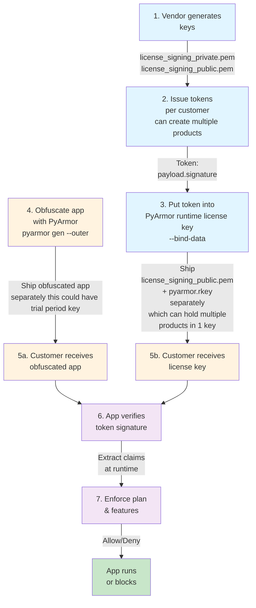

# licensekit
Pure-Python ECDSA license tokens for PyArmor outer keys (bind-data), with plan/feature policy helpers. Designed to work nicely with PyArmor `--outer` + `--bind-data`

## Flow



This package issues and verifies small signed license tokens using **pure-Python ECDSA** (`ecdsa` package).
It is designed to work nicely with **PyArmor `--outer` + `--bind-data`**:

- Vendor generates a signed token (payload JSON + signature).
- Vendor stores that token inside `pyarmor.rkey` using `pyarmor gen key --bind-data`.
- App reads the token from the runtime key (`__pyarmor__(..., b"keyinfo", 1)`), verifies it, and enforces claims.

It also provides:
- Feature flags helper (`ctx.feature("export")`)
- Plan gating (`ctx.require_plan("pro")`)
- Optional public-key file loading + SHA-256 fingerprint pinning to reduce key-swap risk.

## Vendor workflow
1) Generate keys (once)

Using installed CLI:
```shell
licensekit-make-keys --out-dir .
```

This writes:
```shell
</absolute/path/to/>/license_signing_private.pem
</absolute/path/to/>/license_signing_public.pem
```
- _license_signing_private.pem_ (keep secret)
- _license_signing_public.pem_ (safe to ship)

2) Issue a token (per customer)
```shell
licensekit-issue-license  --product my_product  --customer customerA  --plan pro  --days 60  --features export,sync,api  --private-key license_signing_private.pem
```

This prints a token like:
```shell
<base64url(payload_json)>.<base64url(signature)>
```

3) Put token into PyArmor runtime key (outer key)
```shell
licensekit-make-pyarmor-key --token "PASTE_TOKEN_HERE" --customer customerA --expire-days 60
# outputs: </absolute/path/to/>licenses/customerA/pyarmor.rkey
```

4) LicenseContext in the python Entrypoint

Fingerprint pinning (recommended)

If you load the public key from disk, an attacker could try to replace it with their own.
To reduce that risk, pin an allowlist of public-key fingerprints in your app.

To compute fingerprint:
```shell
licensekit-show-public-key-fingerprint
```

Then embed that hex digest string in your app as `PINNED = ["..."]`.

App usage (PyArmor hook / earliest startup)
Load public key from file + fingerprint pinning
```python
from licensekit import LicenseContext

print("Started Test.py")

PINNED = ["<sha256 hex fingerprint>"]

print("Getting License Context")
ctx = LicenseContext.from_pyarmor_files(
    pubkey_path="license_signing_public.pem",
    expected_product="my_product",
    require_customer=True,
    require_plan=True,
    pinned_fingerprints_sha256=PINNED,
    search=True,
    base_file=__file__,
)

print("Checking Pro plan")
ctx.require_plan("pro")
print("has Pro plan")

if ctx.feature("export"):
    print("Export enabled")
```

Use embedded public key bytes (no file loading)
```python
from licensekit import LicenseContext

PUBLIC_KEY_PEM = b\"\"\"-----BEGIN PUBLIC KEY-----
... contents ...
-----END PUBLIC KEY-----\"\"\"

ctx = LicenseContext.from_pyarmor(
    public_key_pem=PUBLIC_KEY_PEM,
    expected_product="my_product",
    require_customer=True,
    require_plan=True,
)
```

5) Obfuscate with PyArmor (outer key required)
```shell
pyarmor gen --outer -O dist test.py
```

Ship dist/ without the key. Provide customer pyarmor.rkey.

Shipping a public key file next to the runtime key

You may also ship:
- license_pub.pem (public key PEM)
- pyarmor.rkey

in the same folder, then load the public key from disk at runtime.

## Payload schema (suggested)
Typical payload fields:

- `product` (string) required
- `customer` (string) optional but recommended
- `plan` ("free" | "pro" | "enterprise") optional but recommended
- `issued_at` (unix epoch int) recommended
- `expires_at` (unix epoch int; 0 means no expiry) recommended
- `features` (list of strings) optional

You can add extra claims (like seat counts, feature bundles, etc.) and enforce them in your app.

## Development
### Install the local environment
```shell
python -m venv venv
```

#### Windows
```shell
venv/scripts/activate
```

#### Mac/Linux
```shell
source venv/bin/activate
```

### Install the local `Plugo` project
#### Install `poetry` package manager
```shell
pip install poetry
```

#### Lock `poetry` dependencies
```shell
poetry cache clear pypi --all -n
poetry lock
```

#### Install `plugo` package via `poetry` (including dependencies)
```shell
poetry install --all-extras
```

### Test
```shell
pytest
coverage run -m pytest
coverage report
coverage html
mypy --html-report mypy_report .
flake8 . --count --select=E9,F63,F7,F82 --show-source --statistics --format=html --htmldir="flake8_report/basic" --exclude=venv
flake8 . --count --exit-zero --max-complexity=11 --max-line-length=127 --statistics --format=html --htmldir="flake8_report/complexity" --exclude=venv
```

### BumpVer
With the CLI command `bumpver`, you can search for and update version strings in your project files. It has a flexible pattern syntax to support many version schemes (SemVer, CalVer or otherwise).
Run BumbVer with:
```shell
bumpver update --major
bumpver update --minor
bumpver update --patch
```

### Build
```shell
poetry build
```

### Publish
```shell
poetry publish
```

### Automated PyPI Publishing

This project uses GitHub Actions to automatically publish to PyPI when a new version tag is pushed.

#### Setup (One-time configuration)

1. **Register a Trusted Publisher on PyPI**:
   - Go to https://pypi.org/manage/account/publishing/
   - Click "Add a new pending publisher"
   - Fill in the following details:
     - **PyPI Project Name**: `plugo`
     - **Owner**: `RyanJulyan` (your GitHub username)
     - **Repository name**: `plugo`
     - **Workflow name**: `publish.yml`
     - **Environment name**: `pypi`
   - Click "Add pending publisher"

#### How it works

When you use `bumpver` to update the version:
```shell
bumpver update --patch  # or --minor, --major
```

This will:
1. Update the version in `pyproject.toml`, `src/plugo/__init__.py`, and `README.md`
2. Create a git commit with the version bump
3. Create a git tag (e.g., `4.0.1`)
4. Push the tag to GitHub

GitHub Actions will automatically detect the new tag and:
1. Build the distribution packages (wheel and source)
2. Publish to PyPI using the trusted publisher authentication

#### Security

This approach uses **OpenID Connect (OIDC) Trusted Publishers**, which is more secure than API tokens because:
- ✅ No credentials are stored in GitHub secrets
- ✅ Only this specific workflow can publish
- ✅ Only from this specific repository
- ✅ PyPI automatically verifies the request is legitimate
